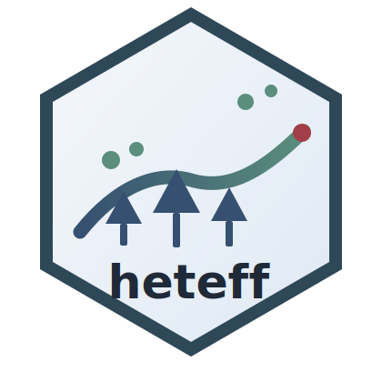

# heteff 

[](https://dai540.github.io/heteff/)
[](https://github.com/dai540/heteff/releases)
[](LICENSE)

`heteff` is an R package for causal inference with generalized random forests.
It focuses on heterogeneous treatment effect estimation with three core
workflows:

<https://dai540.github.io/heteff/>

- `fit_observational_forest()` for conditional treatment effects
- `fit_survival_forest()` for right-censored heterogeneous survival effects
- `fit_instrumental_forest()` for conditional local IV effects

The package is intentionally narrow. It does not try to wrap all of `grf`.
Instead, it standardizes the workflows, tables, plots, and tutorials around
the three estimators that are most useful for heterogeneous effect analysis.
In practical terms, `heteff` is a generalized random forest package for
causal forest, causal survival forest, and instrumental forest workflows in R.

It is designed for analysts working on heterogeneous treatment effects,
survival treatment heterogeneity, instrumental variables, subgroup discovery,
and interpretable causal effect analysis.

## Installation

Install from GitHub:

```r
install.packages("pak")
pak::pak("dai540/heteff")
```

Or:

```r
install.packages("remotes")
remotes::install_github("dai540/heteff")
```

Or install from a source tarball:

```r
install.packages("path/to/heteff_2.1.1.tar.gz", repos = NULL, type = "source")
```

Then load the package:

```r
library(heteff)
```

## Citation

If you use `heteff`, cite the package as:

> Dai (2026). *heteff: Simple GRF Workflows for Heterogeneous Effects*. R package.
> <https://dai540.github.io/heteff/>

You can also retrieve the citation from R:

```r
citation("heteff")
```

## Documentation

<https://dai540.github.io/heteff/>

## Core estimands

### Observational workflow

```text
tau(x) = E[Y(1) - Y(0) | X = x]
```

### Survival workflow

At a user-specified horizon, `heteff` estimates either:

- subgroup-specific restricted mean survival time differences
- subgroup-specific survival-probability differences

### Instrumental workflow

```text
tau(x) = Cov(Y, Z | X = x) / Cov(W, Z | X = x)
```

## What heteff does

`heteff` does three things.

- Fits one of three `grf` estimators from a single analysis table
- Converts sample-level predictions into reusable effect tables and subgroup tables
- Adds a compact interpretation layer through standard plots and explanation trees

In practice, the package is doing this:

- `fit_observational_forest()` runs `grf::causal_forest()`
- `fit_survival_forest()` runs `grf::causal_survival_forest()`
- `fit_instrumental_forest()` runs `grf::instrumental_forest()`
- each fit is converted into:
  - `effect_table`
  - `subgroup_table`
  - `tree_table`
  - `ranking_table`
  - `check_table`
  - `estimand_table`
  - `variable_importance`
- a shallow explanation tree is fit on predicted heterogeneous effects so that subgroup rules are readable

## Main functions

- `fit_observational_forest()`
- `fit_survival_forest()`
- `fit_instrumental_forest()`
- `case_study_catalog()`
- `run_case_study()`
- `export_tables()`
- `export_plots()`

## Standard plots

### Observational and survival workflows

- `plot_observational_dag()`
- `plot_treatment_outcome()`
- `plot_subgroup_effects()`
- `plot_effect_tree()`
- `plot_variable_importance()`

### Instrumental workflows

- `plot_instrumental_dag()`
- `plot_first_stage()`
- `plot_reduced_form()`
- `plot_subgroup_effects()`
- `plot_effect_tree()`
- `plot_variable_importance()`

## Built-in tutorial datasets

The package now ships with public case studies across several domains.

### Observational forests

- `observational_nhefs`
  - epidemiology
  - `causaldata::nhefs_complete`
- `observational_nsw`
  - labor economics / policy evaluation
  - `causaldata::nsw_mixtape`

### Survival forests

- `survival_veteran`
  - clinical survival
  - `survival::veteran`
- `survival_rotterdam`
  - oncology survival
  - `survival::rotterdam`

### Instrumental forests

- `instrumental_card`
  - education economics
  - `ivmodel::card.data`
- `instrumental_schooling`
  - returns to schooling
  - `ivreg::SchoolingReturns`

## Example

```r
library(heteff)

fit <- run_case_study("observational_nhefs", num_trees = 300, seed = 123)

print(fit)
fit$subgroup_table
fit$variable_importance

plot_observational_dag()
plot_treatment_outcome(fit)
plot_subgroup_effects(fit)
plot_effect_tree(fit)
```

## Tutorials

The tutorial site is organized around:

- `Getting Started`
  - synthetic observational, survival, and instrumental examples
- observational case studies
  - NHEFS
  - NSW
- survival case studies
  - Veteran
  - Rotterdam
- instrumental case studies
  - Card
  - SchoolingReturns

## What heteff cannot do yet

- It does not expose all of `grf`
- It does not implement policy learning
- It does not implement domain-specific instrument construction pipelines such as LD clumping or colocalization
- It does not implement latent-treatment or proxy-treatment identification
- It does not provide production-grade reporting beyond tables, plots, and tutorials

## Package layout

- `R/fit.R`: forest workflows
- `R/plots.R`: standard interpretation plots
- `R/simulate.R`: synthetic analysis tables
- `R/cases.R`: public case-study helpers
- `R/io.R`: export helpers
- `R/instrument.R`: simple instrument-score helper
- `vignettes/`: theory, getting-started, and case-study tutorials
