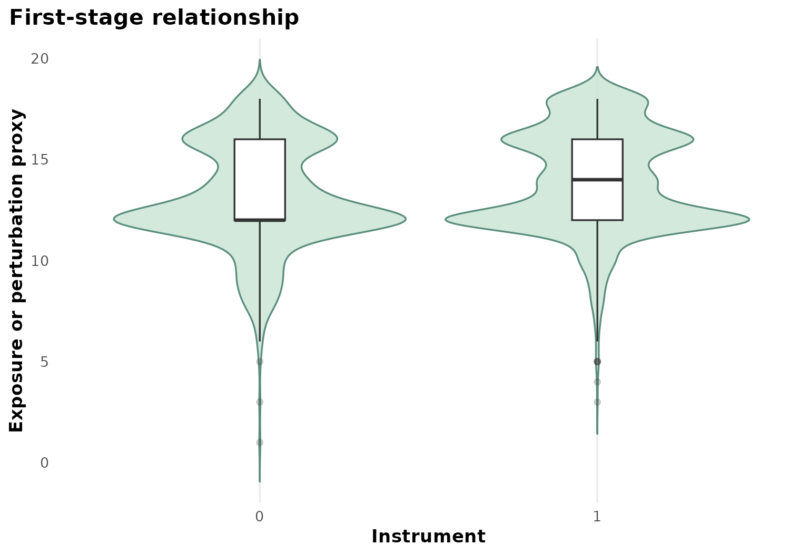
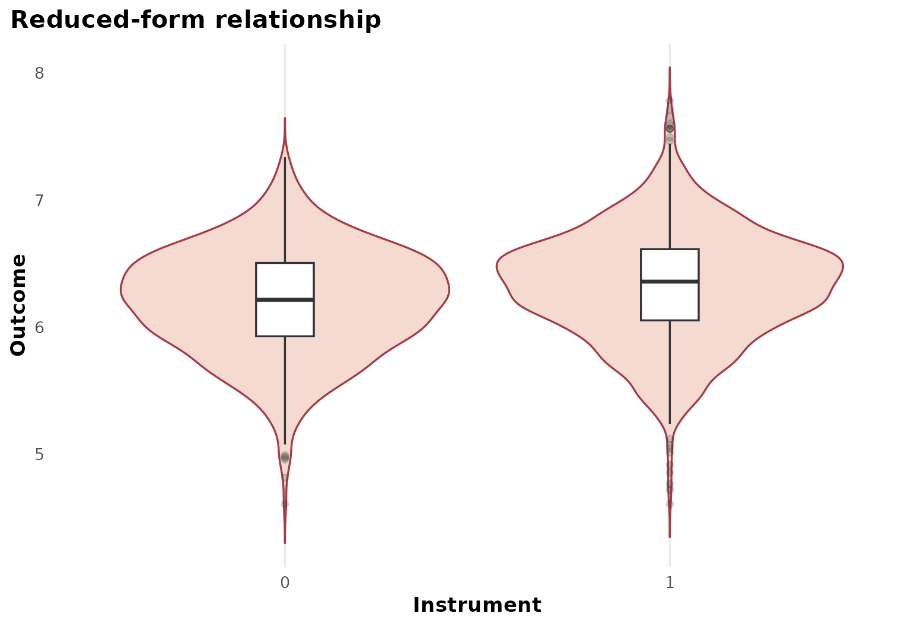
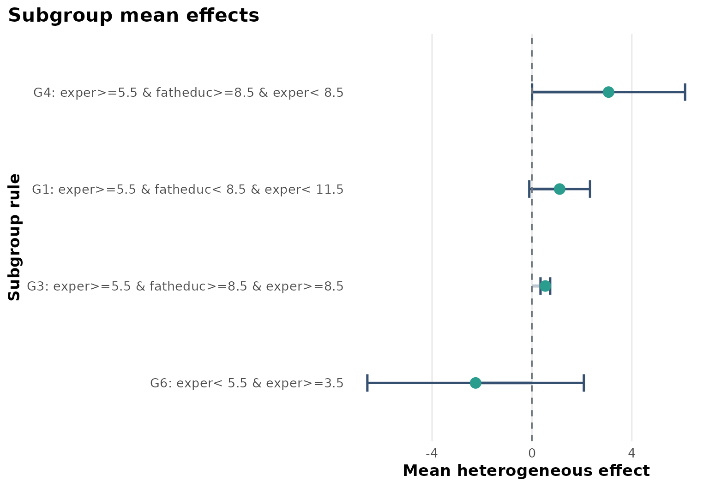
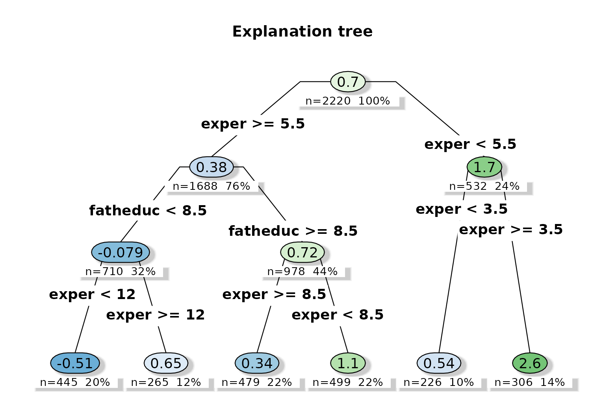
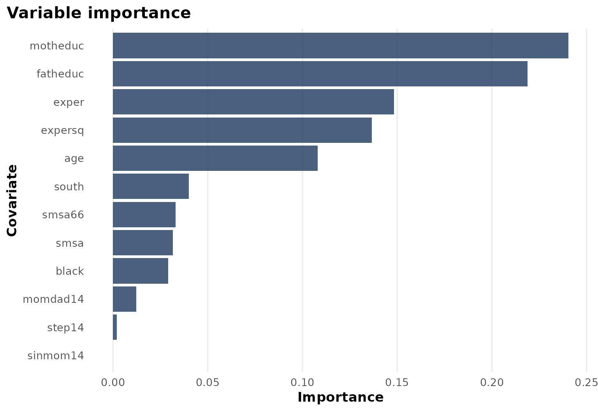

# Case Study: card.data

``` r
library(heteff)
```

## Background

[`ivmodel::card.data`](https://rdrr.io/pkg/ivmodel/man/card.data.html)
is one of the standard teaching datasets for instrumental variables. It
studies returns to schooling using college proximity as an instrument
for education.

## Objective

The goal is to move from a single IV estimate to a subgroup-specific
local IV effect. The question becomes:

$$\tau(x) = \frac{{Cov}(Y,Z \mid X = x)}{{Cov}(W,Z \mid X = x)},$$

where $Y$ is log wage, $W$ is years of education, $Z$ is college
proximity, and $X$ contains observed background variables.

## Analysis setup

``` r
dat <- prepare_case_card_data()

fit <- fit_instrumental_forest(
  data = dat,
  outcome = "outcome",
  treatment = "treatment",
  instrument = "instrument",
  covariates = setdiff(names(dat), c("sample_id", "outcome", "treatment", "instrument")),
  sample_id = "sample_id",
  seed = 123,
  num_trees = 400,
  tree_minbucket = 160
)
#> Warning in get_scores.instrumental_forest(forest, subset = subset,
#> debiasing.weights = debiasing.weights, : The instrument appears to be weak,
#> with some compliance scores as low as -0.359

fit$check_table
#>                 check_name        value status
#> 1                rows_used 2220.0000000   info
#> 2     rows_dropped_missing    0.0000000     ok
#> 3               outcome_sd    0.4396932     ok
#> 4             treatment_sd    2.5877066     ok
#> 5            instrument_sd    0.4631137     ok
#> 6 cor_treatment_instrument    0.1258198     ok
#> 7            first_stage_f   35.6771160     ok
fit$subgroup_table
#>   subgroup                                     rule   n effect_mean
#> 1       G1 exper>=5.5 & fatheduc< 8.5 & exper< 11.5 499    1.110766
#> 2       G3  exper>=5.5 & fatheduc>=8.5 & exper>=8.5 226    0.536643
#> 3       G4  exper>=5.5 & fatheduc>=8.5 & exper< 8.5 306    3.070764
#> 4       G6                  exper< 5.5 & exper>=3.5 479   -2.255946
#>     effect_low effect_high
#> 1 -0.105598562    2.327130
#> 2  0.343413025    0.729873
#> 3  0.004119645    6.137409
#> 4 -6.592747148    2.080855
```

## Design view

``` r
plot_instrumental_dag()
```


The DAG emphasizes why IV is needed: unmeasured determinants of
schooling and wages can bias a naive observational effect of education.

## First stage

``` r
plot_first_stage(fit)
```



The first-stage figure shows whether the instrument visibly shifts
education. This is not a full relevance analysis, but it is a useful
visual complement to the first-stage F-statistic in `check_table`.

## Reduced form

``` r
plot_reduced_form(fit)
```



The reduced-form plot shows whether the instrument is also associated
with the outcome. Together, the first-stage and reduced-form views help
interpret the ratio estimand used by the instrumental forest.

## Heterogeneous effect summary

``` r
plot_subgroup_effects(fit)
```



The subgroup plot shows that the local IV effect is not estimated as
constant. In this example, parental education and labor-market
experience help organize the heterogeneity.

## Explanation tree

``` r
plot_effect_tree(fit)
```



The explanation tree provides a readable summary of where the forest
places its largest local-effect differences.

## Variable importance

``` r
plot_variable_importance(fit)
```



The top variables line up with an interpretable story: background
advantage and experience shape where education returns appear most
differentiated.

## Interpretation

This case study is useful because it turns a standard IV tutorial into a
heterogeneity tutorial:

- the first stage is visible,
- the reduced form is visible,
- subgroup differences can be summarized rather than left as one global
  IV coefficient.

## Limitations

The package still reports weak-IV warnings for some leaves in this
dataset. That means subgroup interpretation should be cautious. The
local IV forest is most informative as a structured exploration of
heterogeneous compliance-driven effects, not as automatic evidence that
every leaf is equally well identified.
