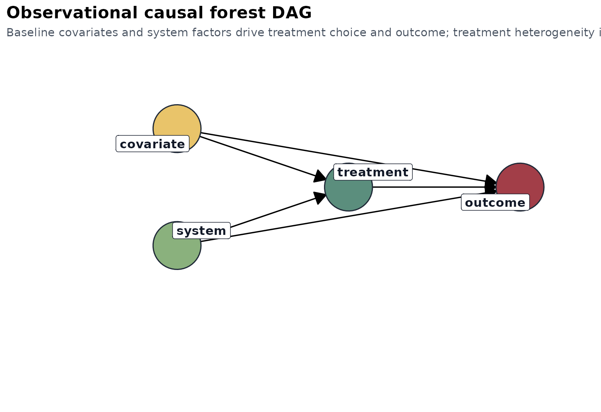
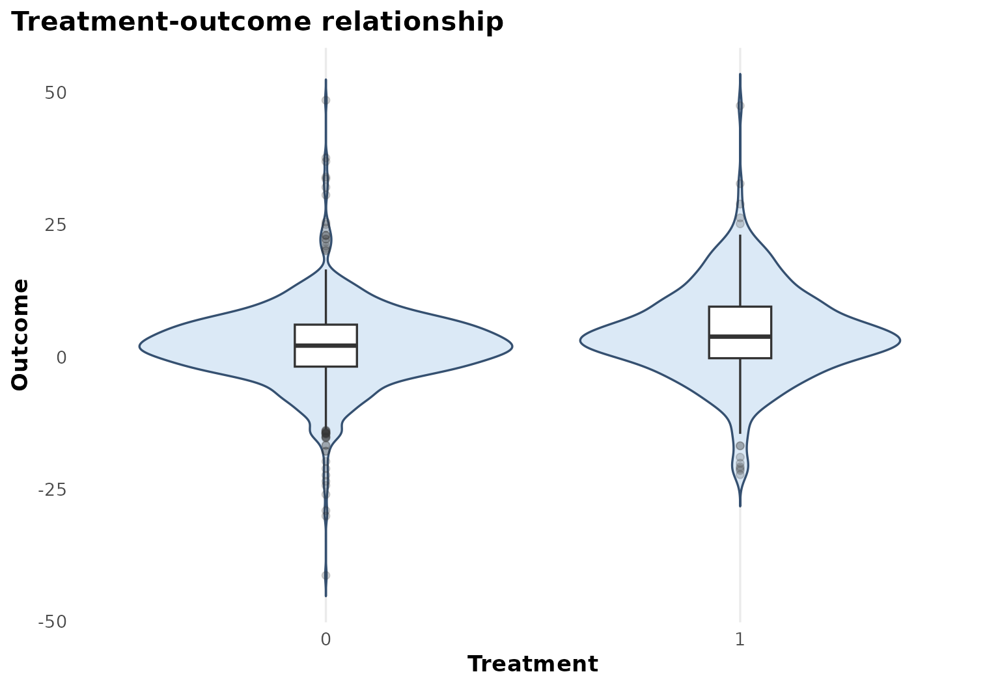
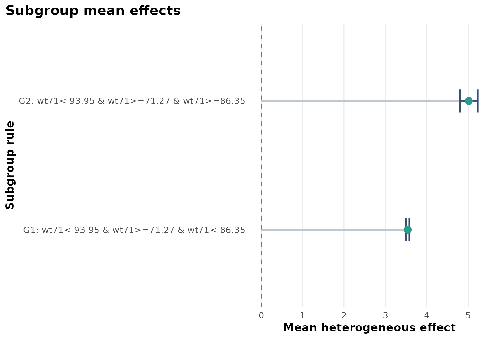
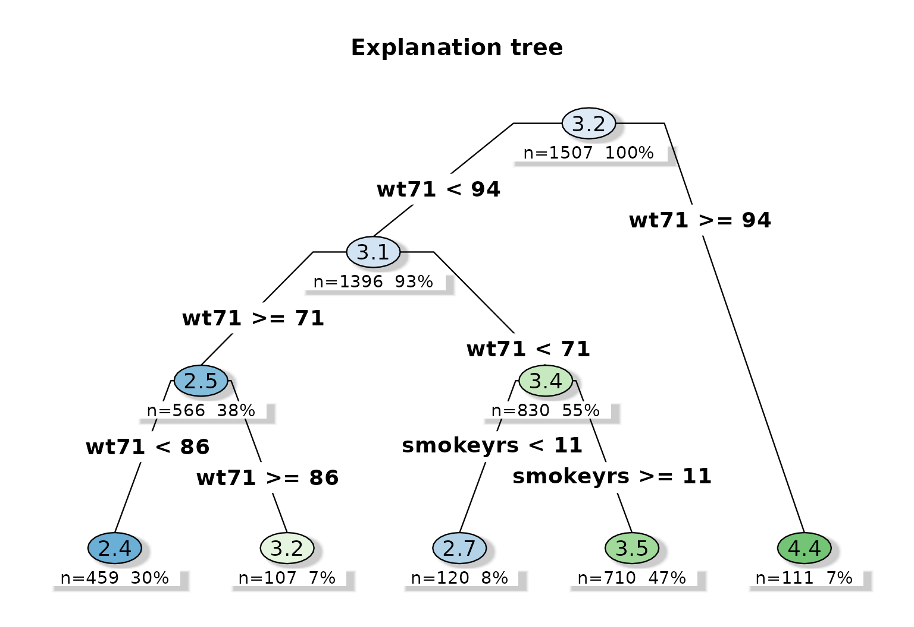
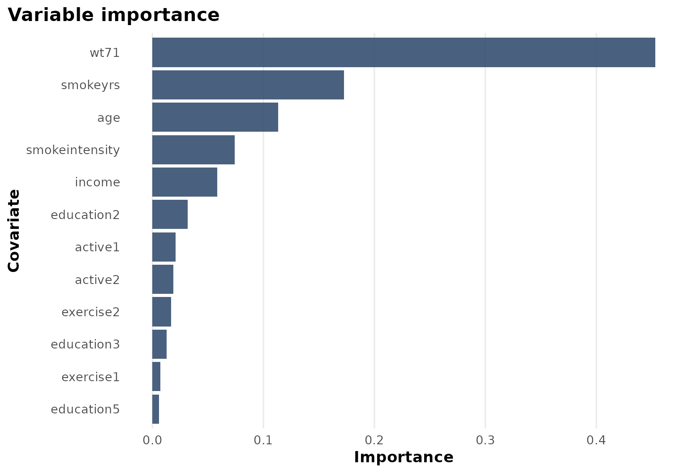

# Case Study: NHEFS

``` r
library(heteff)
```

## Background

[`causaldata::nhefs_complete`](https://rdrr.io/pkg/causaldata/man/nhefs_complete.html)
is one of the standard epidemiologic datasets used to study the
consequences of smoking cessation. In this tutorial the outcome is
weight change, the treatment is quitting smoking, and the covariates
summarize baseline smoking behavior and demographic background.

## Objective

The goal is not only to estimate an average effect of quitting smoking
on later weight change, but to identify whether the effect is
systematically larger in some baseline strata than in others.

Formally, the target is:

$$\tau(x) = E\left\lbrack Y(1) - Y(0) \mid X = x \right\rbrack,$$

where $Y$ is weight change, $W$ is smoking cessation, and $X$ contains
baseline characteristics.

## Analysis setup

``` r
dat <- prepare_case_nhefs()

fit <- fit_observational_forest(
  data = dat,
  outcome = "outcome",
  treatment = "treatment",
  covariates = setdiff(names(dat), c("sample_id", "outcome", "treatment")),
  sample_id = "sample_id",
  seed = 123,
  num_trees = 400,
  tree_minbucket = 100
)

fit$check_table
#>             check_name        value status
#> 1            rows_used 1507.0000000   info
#> 2 rows_dropped_missing    0.0000000     ok
#> 3           outcome_sd    7.8462543     ok
#> 4         treatment_sd    0.4340153     ok
#> 5       treatment_rate    0.2514930   info
#> 6      covariate_count   20.0000000   info
fit$subgroup_table
#>   subgroup                                    rule   n effect_mean effect_low
#> 1       G1 wt71< 93.95 & wt71>=71.27 & wt71< 86.35 710    3.537389   3.496328
#> 2       G2 wt71< 93.95 & wt71>=71.27 & wt71>=86.35 111    5.011400   4.796818
#>   effect_high
#> 1    3.578451
#> 2    5.225983
```

## Design view

``` r
plot_observational_dag()
```



The causal story is observational: baseline smoking intensity, prior
weight, and related health behaviors may influence both the decision to
quit and later weight change. The analysis therefore relies on
adjustment through the baseline covariates supplied to the forest.

## Treatment and outcome pattern

``` r
plot_treatment_outcome(fit)
```



This figure is descriptive rather than causal. It shows how outcome
values are distributed across treatment groups before the forest has
adjusted for the full covariate set.

## Heterogeneous effect summary

``` r
plot_subgroup_effects(fit)
```



The subgroup summary indicates that estimated effects are not constant.
In this analysis, the dominant split is baseline weight, with heavier
participants showing larger predicted weight gain after smoking
cessation.

## Explanation tree

``` r
plot_effect_tree(fit)
```



The explanation tree is a compact approximation of the forest’s
sample-level effect predictions. It does not replace the forest;
instead, it provides a readable subgrouping rule for reporting.

## Variable importance

``` r
plot_variable_importance(fit)
```



The importance profile helps explain why the subgroup tree is organized
around baseline weight and smoking history variables.

## Interpretation

This case study produces a coherent epidemiologic story:

- baseline weight is the strongest modifier,
- smoking history features also contribute,
- quitting smoking is associated with larger predicted weight gain in
  heavier baseline subgroups.

The package output is therefore useful not only for estimation, but also
for describing where the treatment effect appears concentrated.

## Limitations

This remains an observational design. The results depend on:

- the adequacy of baseline adjustment,
- the absence of important unmeasured confounding,
- the stability of the subgroup rules across resampling and alternative
  covariate specifications.

The subgroup rules should therefore be treated as structured
heterogeneity summaries, not as automatically transportable decision
rules.
