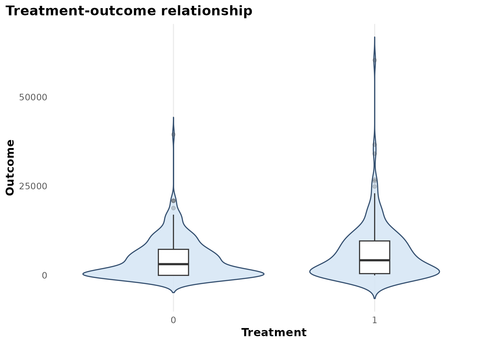
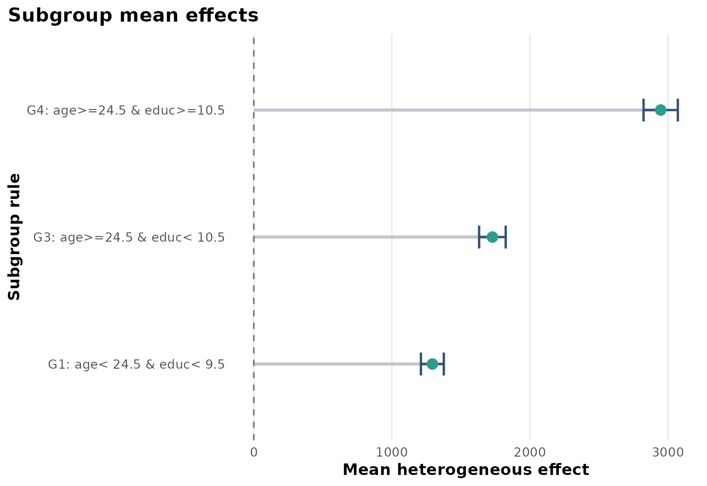
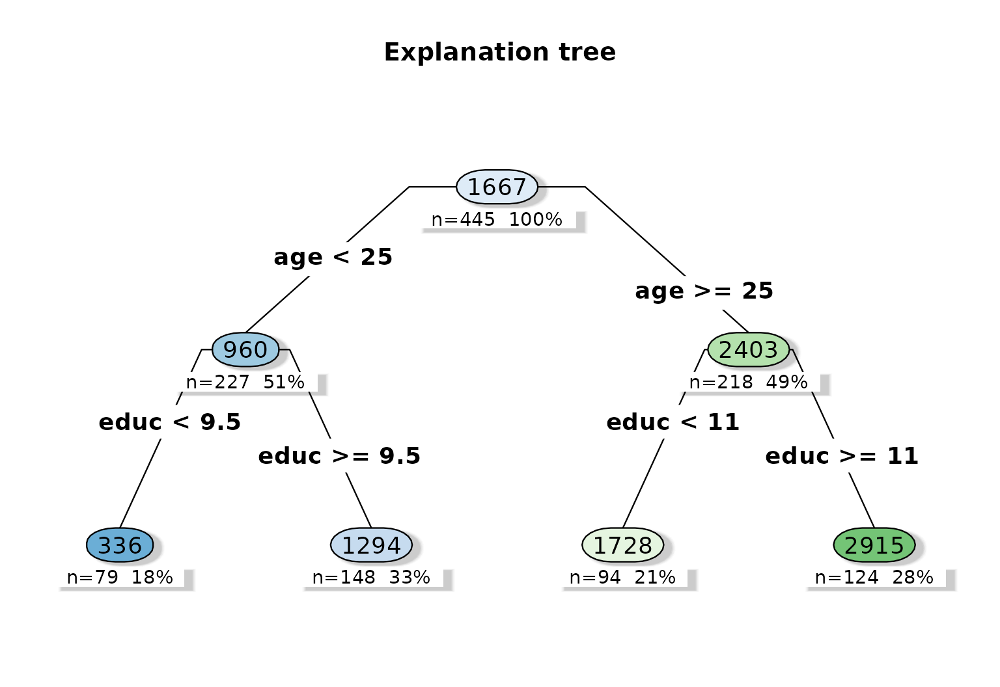
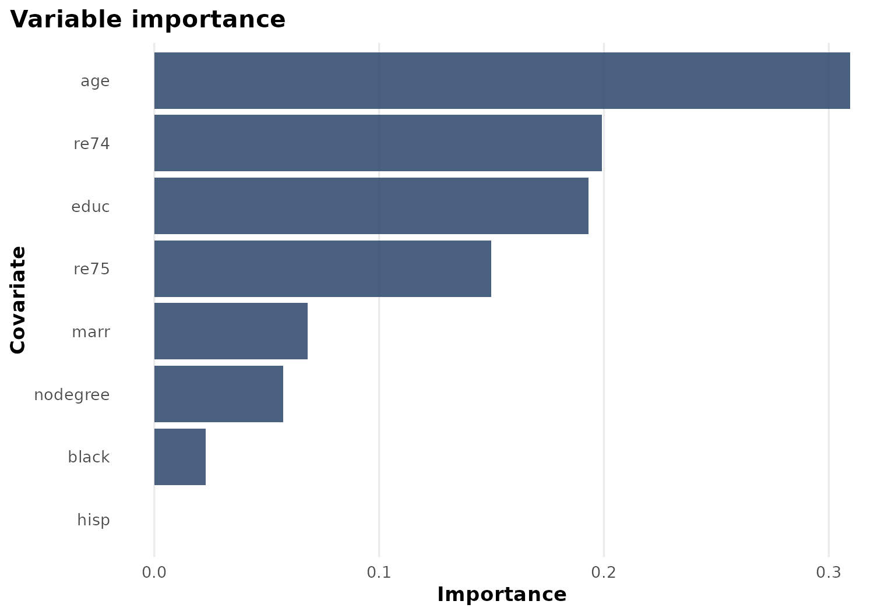

# Case Study: NSW job training

``` r
library(heteff)
```

## Background

[`causaldata::nsw_mixtape`](https://rdrr.io/pkg/causaldata/man/nsw_mixtape.html)
is a standard program-evaluation dataset built around the National
Supported Work training program. It is widely used in causal inference
tutorials because treatment is binary, outcomes are economically
meaningful, and baseline heterogeneity is plausible.

## Objective

The question here is whether the earnings benefit of job training
differs by pre-treatment labor-market history and demographic
background.

The estimand is again:

$$\tau(x) = E\left\lbrack Y(1) - Y(0) \mid X = x \right\rbrack,$$

where $Y$ is post-program earnings and $W$ is program participation.

## Analysis setup

``` r
dat <- prepare_case_nsw()

fit <- fit_observational_forest(
  data = dat,
  outcome = "outcome",
  treatment = "treatment",
  covariates = setdiff(names(dat), c("sample_id", "outcome", "treatment")),
  sample_id = "sample_id",
  seed = 123,
  num_trees = 400,
  tree_minbucket = 50
)

fit$check_table
#>             check_name        value status
#> 1            rows_used  445.0000000   info
#> 2 rows_dropped_missing    0.0000000     ok
#> 3           outcome_sd 6631.4916806     ok
#> 4         treatment_sd    0.4934022     ok
#> 5       treatment_rate    0.4157303   info
#> 6      covariate_count   12.0000000   info
fit$subgroup_table
#>   subgroup                   rule   n effect_mean effect_low effect_high
#> 1       G1  age< 24.5 & educ< 9.5 148    1293.561   1210.623    1376.498
#> 2       G3 age>=24.5 & educ< 10.5  94    1728.480   1632.111    1824.848
#> 3       G4 age>=24.5 & educ>=10.5 124    2947.757   2823.516    3071.998
```

## Design view

``` r
plot_observational_dag()
```


In this tutorial, the DAG emphasizes baseline confounding by age,
education, marital status, and lagged earnings history.

## Treatment and outcome pattern

``` r
plot_treatment_outcome(fit)
```



The raw treatment-outcome view gives the scale of the earnings outcome
and helps contextualize the subgroup-specific effect estimates.

## Heterogeneous effect summary

``` r
plot_subgroup_effects(fit)
```



The subgroup summary shows a clear gradient: older and more educated
strata in this analysis tend to have larger predicted earnings gains
than the youngest, least educated stratum.

## Explanation tree

``` r
plot_effect_tree(fit)
```



The explanation tree provides a readable program-evaluation story. Age
and education dominate the first splits, which aligns with an economic
hypothesis that labor-market readiness modifies the returns to training.

## Variable importance

``` r
plot_variable_importance(fit)
```



Lagged earnings also appear among the leading variables, which is
consistent with the idea that pre-program attachment to the labor market
helps organize treatment heterogeneity.

## Interpretation

This case study is useful because the learned heterogeneity is
substantively readable:

- age and education anchor the subgroup tree,
- prior earnings remain important,
- estimated gains differ enough across leaves to make subgroup summaries
  worth reporting.

## Limitations

Even in a familiar teaching dataset, subgroup patterns should not be
overread. The explanation tree is still a second-stage summary of forest
predictions, and the subgrouping pattern can move under alternative
tuning or alternative covariate definitions.
