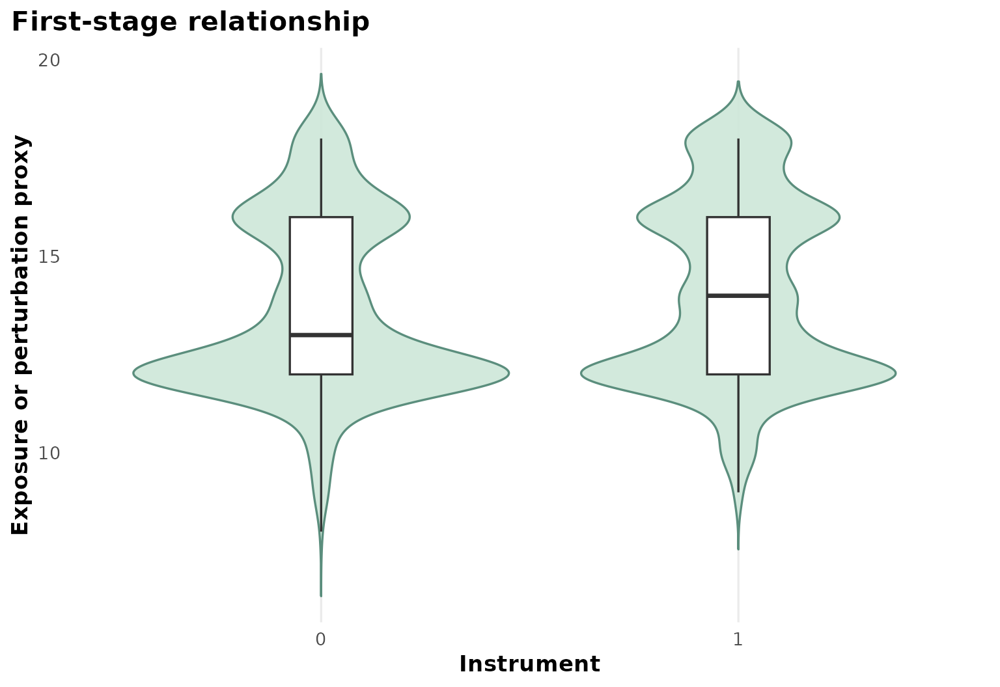
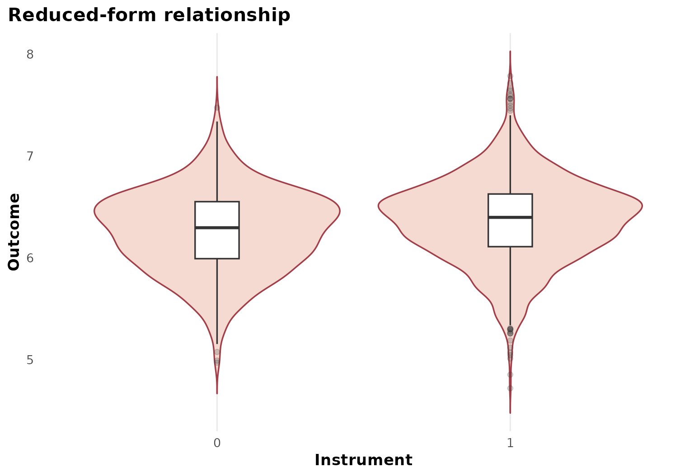
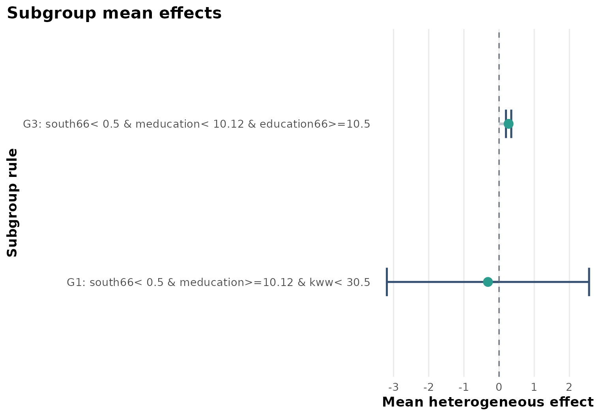
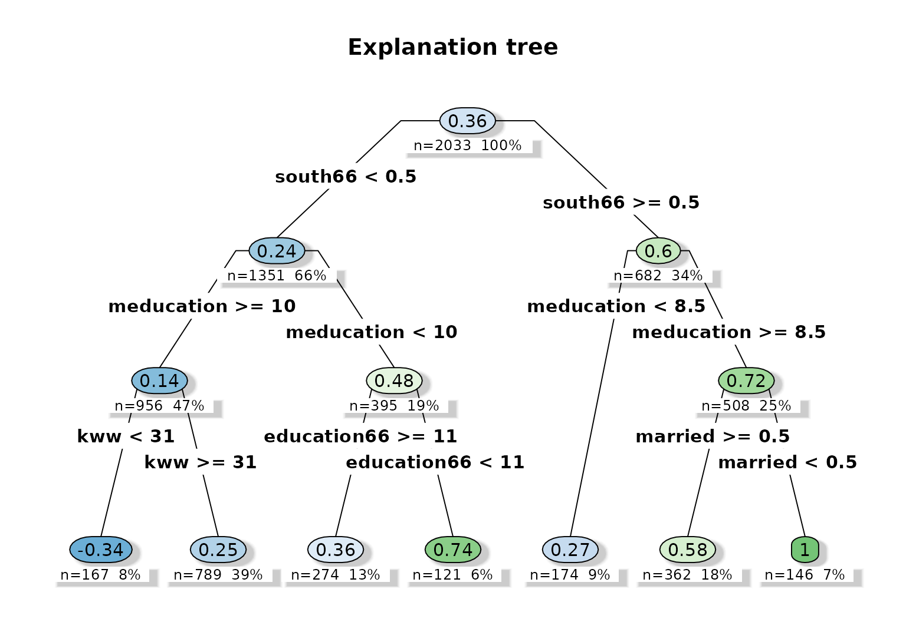
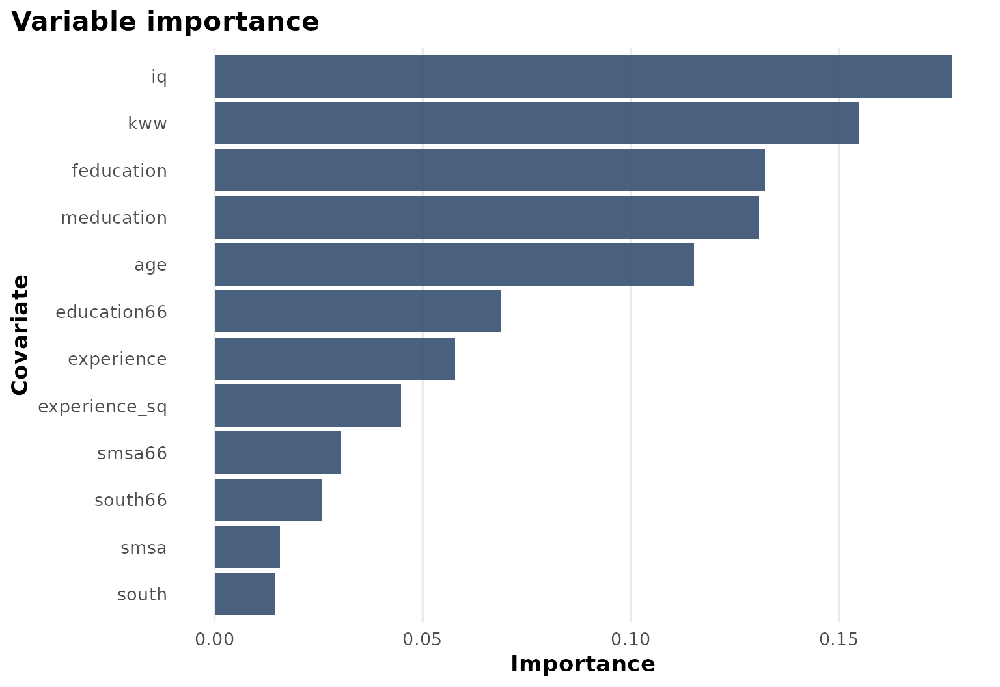

# Case Study: SchoolingReturns

``` r
library(heteff)
```

## Background

[`ivreg::SchoolingReturns`](https://zeileis.github.io/ivreg/reference/SchoolingReturns.html)
is another returns-to-schooling dataset with college proximity
instruments and a richer collection of baseline socioeconomic covariates
than the simpler Card example.

## Objective

The purpose of this tutorial is to show the same IV workflow on a higher
dimensional baseline space. The estimand is the subgroup-specific local
IV effect of education on log wages.

## Analysis setup

``` r
dat <- prepare_case_schooling_returns()

fit <- fit_instrumental_forest(
  data = dat,
  outcome = "outcome",
  treatment = "treatment",
  instrument = "instrument",
  covariates = setdiff(names(dat), c("sample_id", "outcome", "treatment", "instrument")),
  sample_id = "sample_id",
  seed = 123,
  num_trees = 400,
  tree_minbucket = 80
)
#> Warning in get_scores.instrumental_forest(forest, subset = subset,
#> debiasing.weights = debiasing.weights, : The instrument appears to be weak,
#> with some compliance scores as low as -0.1058

fit$check_table
#>                 check_name        value status
#> 1                rows_used 2.033000e+03   info
#> 2     rows_dropped_missing 0.000000e+00     ok
#> 3               outcome_sd 4.177972e-01     ok
#> 4             treatment_sd 2.275749e+00     ok
#> 5            instrument_sd 4.551006e-01     ok
#> 6 cor_treatment_instrument 9.353879e-02     ok
#> 7            first_stage_f 1.792710e+01     ok
fit$subgroup_table
#>   subgroup                                                 rule   n effect_mean
#> 1       G1         south66< 0.5 & meducation>=10.12 & kww< 30.5 121  -0.3156606
#> 2       G3 south66< 0.5 & meducation< 10.12 & education66>=10.5 174   0.2716612
#>   effect_low effect_high
#> 1 -3.1901339    2.558813
#> 2  0.1961033    0.347219
```

## Design view

``` r
plot_instrumental_dag()
```


The DAG is the same IV logic as in the Card example, but the baseline
covariates now allow a more detailed heterogeneity decomposition.

## First stage

``` r
plot_first_stage(fit)
```



The first-stage panel shows the instrument-exposure link at the
analysis-table level.

## Reduced form

``` r
plot_reduced_form(fit)
```



The reduced-form panel complements the first stage by showing the
instrument-outcome relationship.

## Heterogeneous effect summary

``` r
plot_subgroup_effects(fit)
```



The subgroup plot suggests that local IV effects differ across baseline
family education and cognitive-score profiles.

## Explanation tree

``` r
plot_effect_tree(fit)
```



The explanation tree turns the forest predictions into readable rules.
In this example, parental education, baseline schooling, and measured
skill variables all contribute.

## Variable importance

``` r
plot_variable_importance(fit)
```



The importance ranking helps connect the tree back to the full forest
fit.

## Interpretation

This tutorial is valuable because it shows that the instrumental
workflow is not limited to one famous teaching dataset. The same logic
transfers to a larger baseline space, while keeping a consistent set of
outputs.

## Limitations

As with any local IV analysis, interpretation depends on instrument
validity and local compliance. The subgroup rules should therefore be
read as summaries of where the local IV effect appears to vary, not as
universal returns to schooling estimates for all populations.
