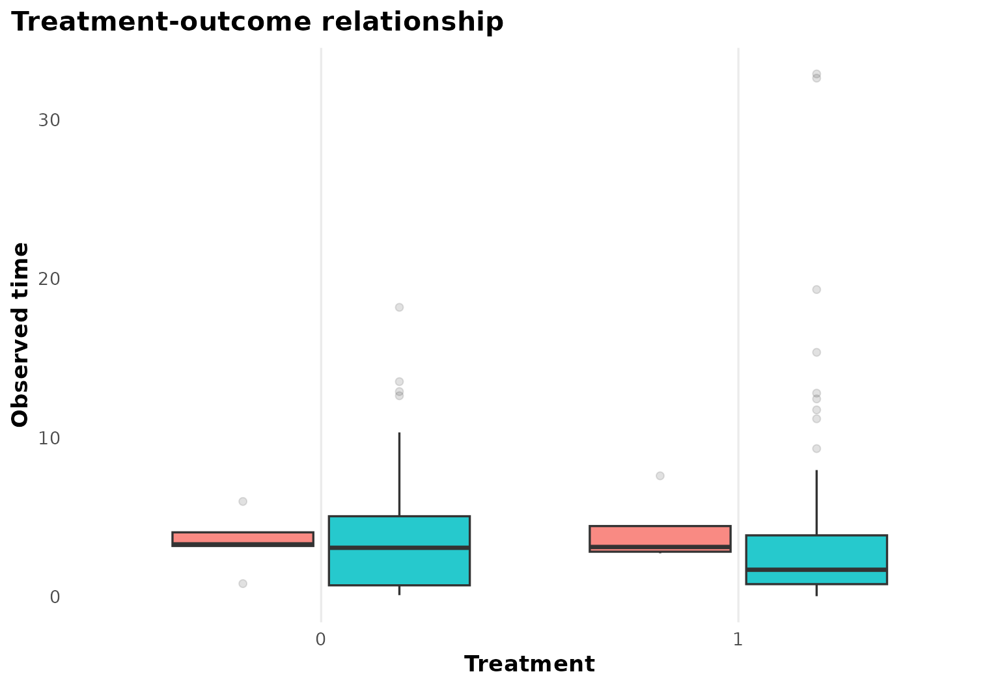
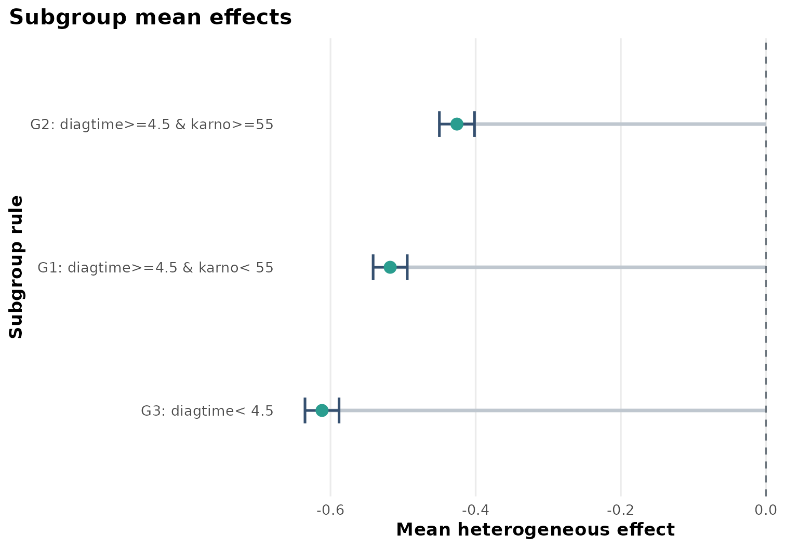
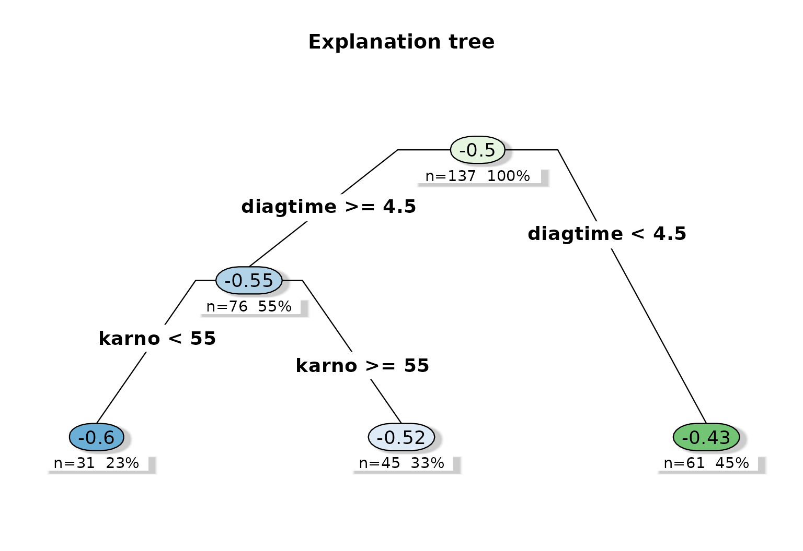
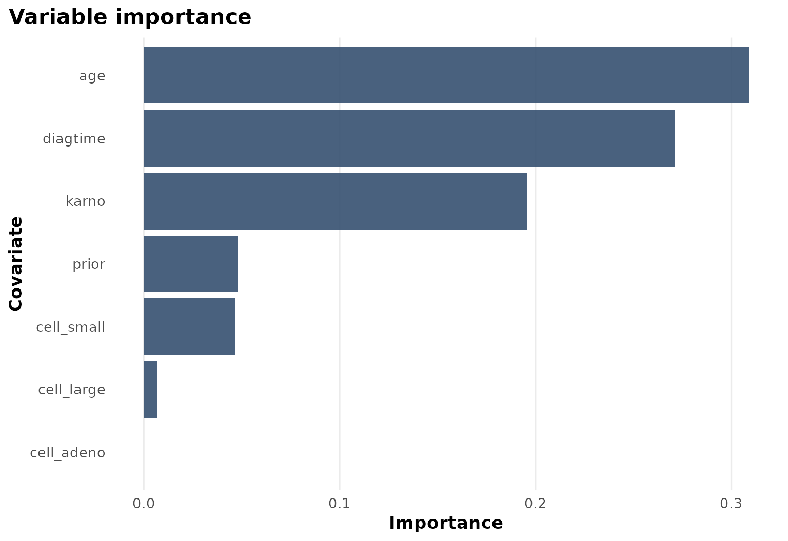

# Case Study: Veteran survival

``` r
library(heteff)
```

## Background

[`survival::veteran`](https://rdrr.io/pkg/survival/man/veteran.html) is
a compact clinical survival dataset with treatment, follow-up time,
event status, and baseline prognostic variables such as performance
status and diagnosis time.

## Objective

The main question is whether the treatment effect on survival differs
across baseline prognosis strata.

At horizon $h = 6$ months, the analysis targets a subgroup-specific
survival effect:

$$\tau_{h}(x) = E\left\lbrack \min\left( T(1),h \right) - \min\left( T(0),h \right) \mid X = x \right\rbrack$$

under the RMST target used by the package default.

## Analysis setup

``` r
dat <- prepare_case_veteran()

fit <- fit_survival_forest(
  data = dat,
  time = "time",
  event = "event",
  treatment = "treatment",
  covariates = setdiff(names(dat), c("sample_id", "time", "event", "treatment")),
  sample_id = "sample_id",
  horizon = 6,
  seed = 123,
  num_trees = 400,
  tree_minbucket = 25
)

fit$check_table
#>             check_name        value status
#> 1            rows_used 137.00000000   info
#> 2 rows_dropped_missing   0.00000000     ok
#> 3           outcome_sd   5.19133954     ok
#> 4         treatment_sd   0.50182150     ok
#> 5       treatment_rate   0.49635036   info
#> 6      covariate_count  12.00000000   info
#> 7           event_rate   0.93430657     ok
#> 8          censor_rate   0.06569343   info
#> 9              horizon   6.00000000   info
fit$subgroup_table
#>   subgroup                      rule  n effect_mean effect_low effect_high
#> 1       G1 diagtime>=4.5 & karno< 55 45  -0.5177816 -0.5412978  -0.4942655
#> 2       G2 diagtime>=4.5 & karno>=55 61  -0.4258295 -0.4500205  -0.4016384
#> 3       G3             diagtime< 4.5 31  -0.6117136 -0.6351739  -0.5882533
```

## Design view

``` r
plot_observational_dag()
```


For survival settings the same baseline-adjustment idea applies, but the
outcome is now right-censored time-to-event data rather than a scalar
endpoint.

## Treatment and observed time

``` r
plot_treatment_outcome(fit)
```



This figure shows the observed-time distribution by treatment, including
the event/censoring split.

## Heterogeneous effect summary

``` r
plot_subgroup_effects(fit)
```



The subgroup summary suggests that treatment benefit is not uniform.
Baseline diagnosis time and Karnofsky performance status drive the main
separation.

## Explanation tree

``` r
plot_effect_tree(fit)
```



The tree shows a clinically interpretable pattern: prognosis variables
organize the treatment-effect surface, and the lowest-performance groups
are separated from better-functioning groups.

## Variable importance

``` r
plot_variable_importance(fit)
```



The importance chart reinforces that age, diagnosis time, and Karnofsky
score carry most of the heterogeneity signal.

## Interpretation

This is a good survival tutorial because the results are interpretable:

- clinically recognizable predictors dominate,
- subgroup effects differ enough to justify forest-based heterogeneity
  analysis,
- the explanation tree remains readable.

## Limitations

This is still a small teaching dataset. Survival forests are sensitive
to censoring patterns, horizon choice, and treatment overlap. Subgroup
summaries should therefore be viewed as structured exploratory evidence
rather than as a finished treatment rule.
