# Getting Started with heteff

``` r
library(heteff)
```

`heteff` standardizes three generalized random forest workflows:

- observational causal forests
- causal survival forests
- instrumental forests

The package keeps one interface and one output shape across these
workflows.

## Core estimands

### Observational effect

$$\tau(x) = E\left\lbrack Y(1) - Y(0) \mid X = x \right\rbrack$$

### Survival effect

At a fixed horizon $h$, `heteff` estimates subgroup-specific RMST
differences or survival-probability differences.

### Instrumental effect

$$\tau(x) = \frac{{Cov}(Y,Z \mid X = x)}{{Cov}(W,Z \mid X = x)}$$

## 1. Observational workflow

``` r
obs_data <- simulate_observational_data(n = 1600, seed = 123)

fit_obs <- fit_observational_forest(
  data = obs_data,
  outcome = "outcome",
  treatment = "treatment",
  covariates = c(
    "age", "sex", "ecog", "line", "liver_met", "tmb", "msi",
    "signature_ifn", "baseline_ctdna", "albumin", "crp", "site_volume"
  ),
  sample_id = "sample_id",
  seed = 123,
  num_trees = 400,
  tree_minbucket = 60
)

fit_obs$subgroup_table
#>   subgroup                                                   rule   n
#> 1       G1 signature_ifn< 1.144 & albumin>=4.394 & albumin>=4.487 488
#> 2       G3     signature_ifn< 1.144 & albumin< 4.394 & tmb< 9.006  78
#> 3       G4     signature_ifn< 1.144 & albumin< 4.394 & tmb>=9.006 126
#> 4       G6           signature_ifn>=1.144 & baseline_ctdna>=3.616 714
#>   effect_mean  effect_low   effect_high
#> 1 -0.05782243 -0.06207677 -5.356809e-02
#> 2 -0.01044183 -0.02087649 -7.164707e-06
#> 3  0.02451884  0.01639585  3.264183e-02
#> 4 -0.09816993 -0.10149282 -9.484703e-02
```

``` r
plot_observational_dag()
```


``` r
plot_treatment_outcome(fit_obs)
```

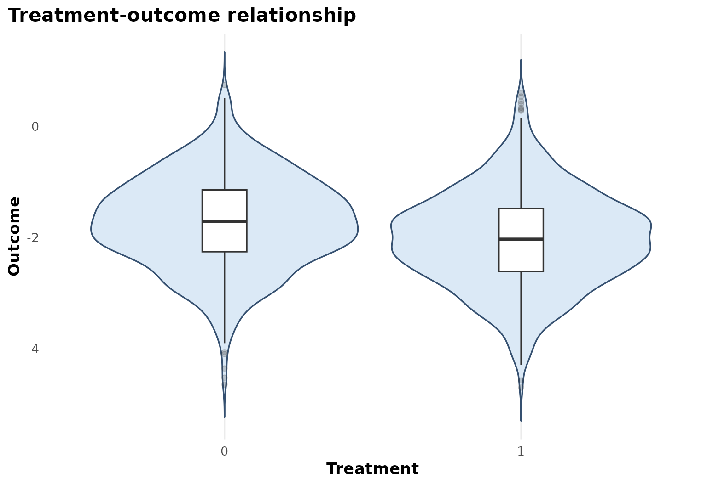

``` r
plot_subgroup_effects(fit_obs)
```

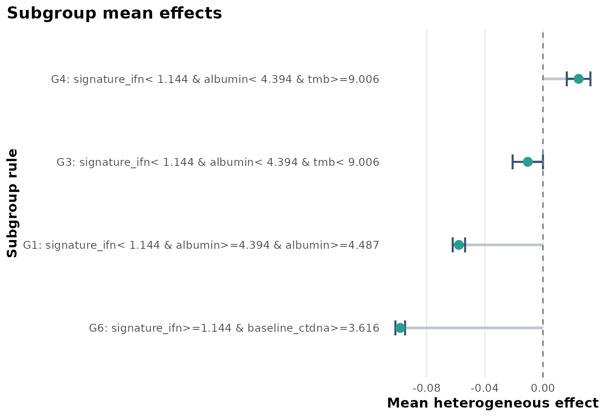

``` r
plot_effect_tree(fit_obs)
```

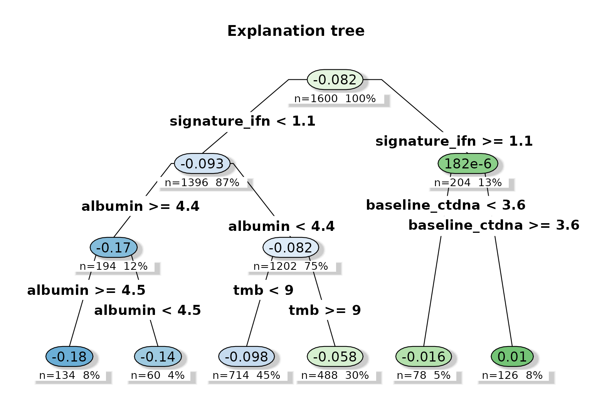

## 2. Survival workflow

``` r
surv_data <- simulate_survival_data(n = 1600, seed = 321, horizon = 12)

fit_surv <- fit_survival_forest(
  data = surv_data,
  time = "time",
  event = "event",
  treatment = "treatment",
  covariates = c(
    "age", "sex", "ecog", "line", "liver_met", "inflammation",
    "biomarker", "pathway_score", "steroid"
  ),
  horizon = 12,
  sample_id = "sample_id",
  seed = 321,
  num_trees = 400,
  tree_minbucket = 60
)
#> Warning in grf::causal_survival_forest(X = as.matrix(analysis_data[,
#> covariates, : Estimated censoring probabilities are lower than 0.2 - an
#> identifying assumption is that there exists a fixed positive constant M such
#> that the probability of observing an event past the maximum follow-up time is
#> at least M (i.e. P(T > horizon | X) > M).

fit_surv$subgroup_table
#>   subgroup                                                                rule
#> 1       G1 biomarker< 0.3695 & pathway_score< 0.6571 & pathway_score< -0.07865
#> 2       G4     biomarker< 0.3695 & pathway_score>=0.6571 & biomarker>=-0.08394
#> 3       G5        biomarker>=0.3695 & pathway_score< 0.3614 & biomarker< 1.112
#> 4       G6        biomarker>=0.3695 & pathway_score< 0.3614 & biomarker>=1.112
#> 5       G7                           biomarker>=0.3695 & pathway_score>=0.3614
#>     n effect_mean effect_low effect_high
#> 1  79   0.2683342  0.2420023   0.2946661
#> 2 235   0.1227126  0.1084979   0.1369273
#> 3 141   0.2767789  0.2555608   0.2979969
#> 4 175   0.4221297  0.3983544   0.4459051
#> 5 207   0.1153143  0.1016789   0.1289496
```

``` r
plot_observational_dag()
```


``` r
plot_treatment_outcome(fit_surv)
```

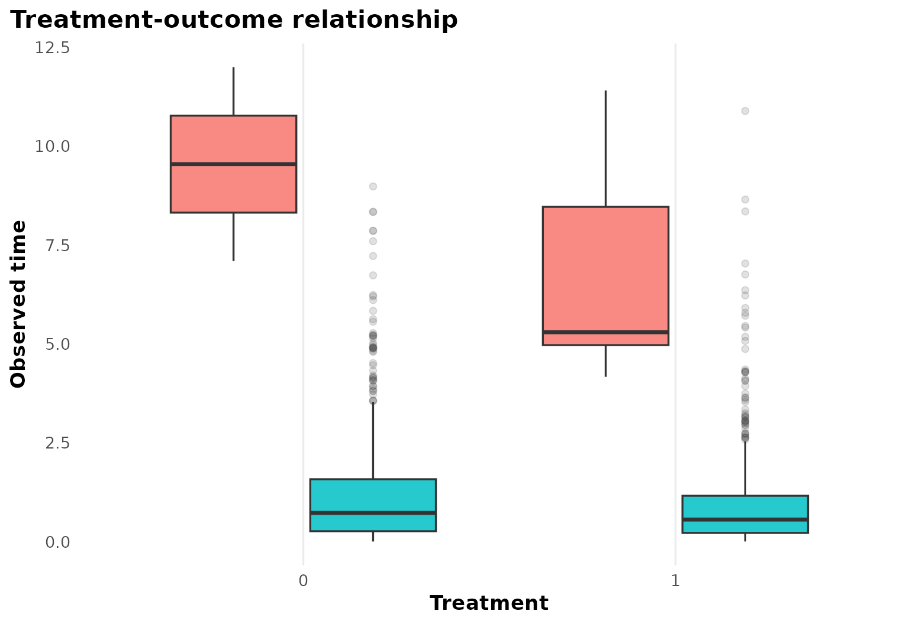

``` r
plot_subgroup_effects(fit_surv)
```

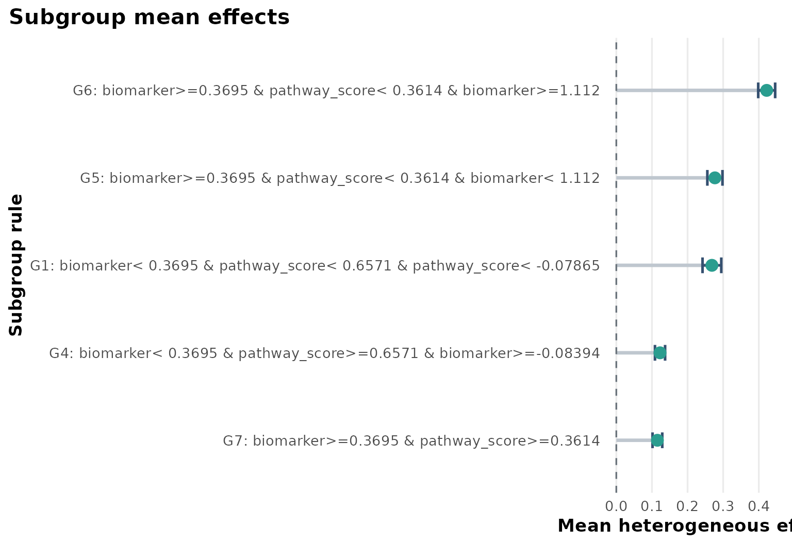

``` r
plot_effect_tree(fit_surv)
```

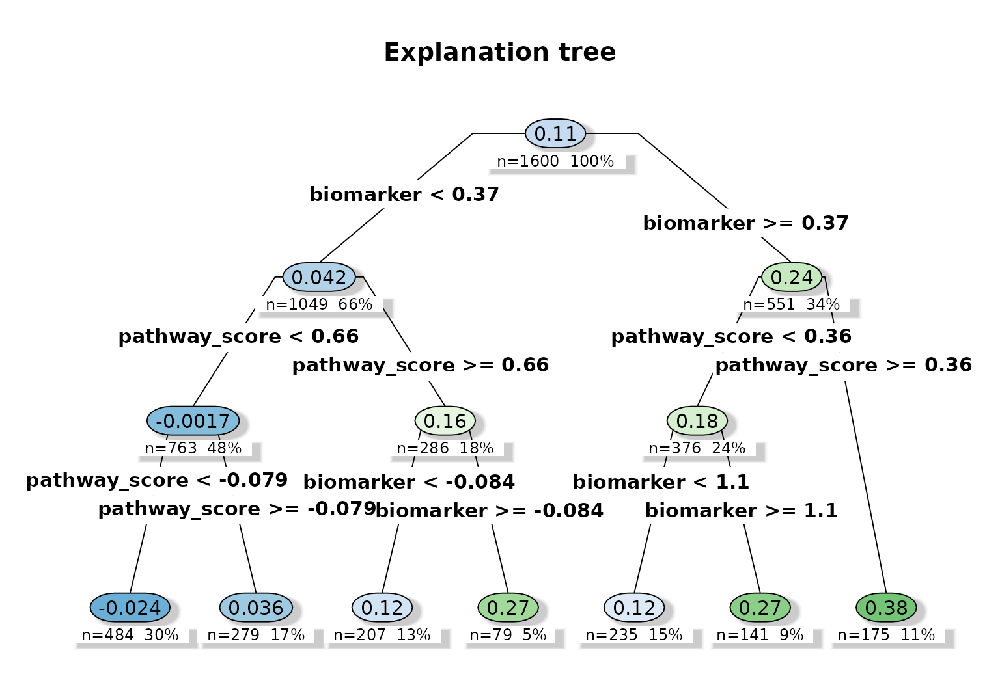

## 3. Instrumental workflow

``` r
iv_data <- simulate_instrumental_data(n = 1600, seed = 456)

fit_iv <- fit_instrumental_forest(
  data = iv_data,
  outcome = "outcome",
  treatment = "treatment",
  instrument = "instrument",
  covariates = c(
    "age", "sex", "bmi", "smoking", "pc1", "pc2",
    "center", "batch", "baseline_risk"
  ),
  sample_id = "sample_id",
  seed = 456,
  num_trees = 400,
  tree_minbucket = 60
)

fit_iv$subgroup_table
#>   subgroup                                           rule   n effect_mean
#> 1       G1 age>=58.5 & baseline_risk>=0.9908 & pc1< 0.683 168  -0.3143326
#> 2       G3 age>=58.5 & baseline_risk< 0.9908 & bmi< 25.23 131  -0.3866758
#>   effect_low effect_high
#> 1 -0.3259700  -0.3026951
#> 2 -0.3983302  -0.3750213
```

``` r
plot_instrumental_dag()
```

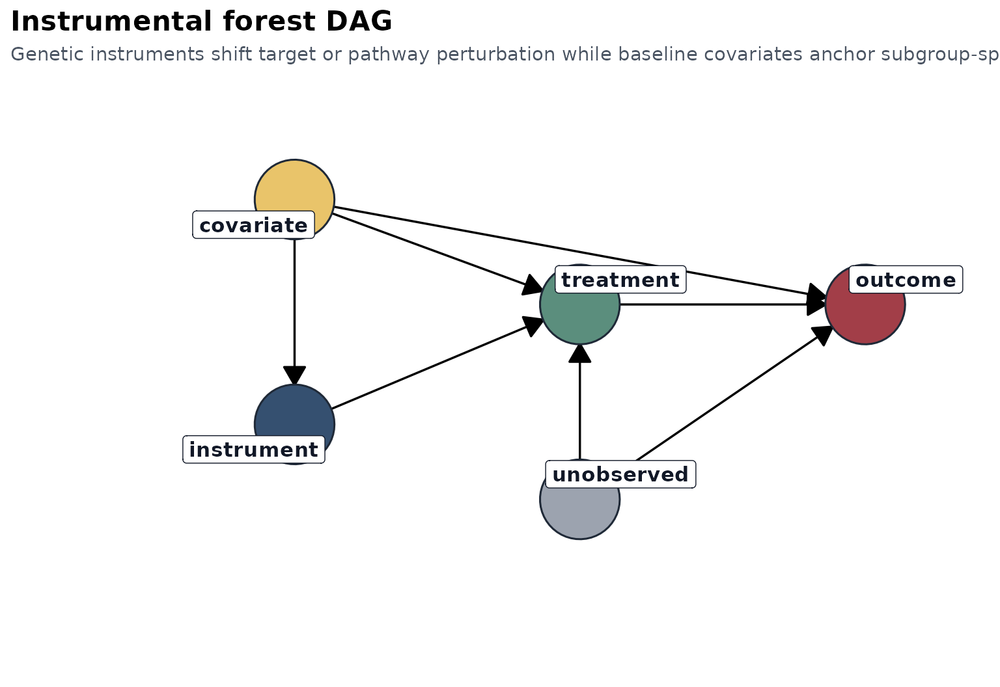

``` r
plot_first_stage(fit_iv)
#> `geom_smooth()` using formula = 'y ~ x'
```

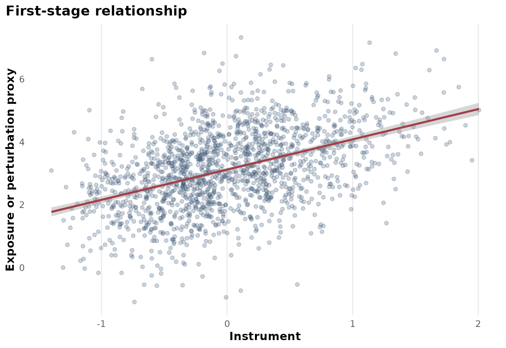

``` r
plot_reduced_form(fit_iv)
#> `geom_smooth()` using formula = 'y ~ x'
```

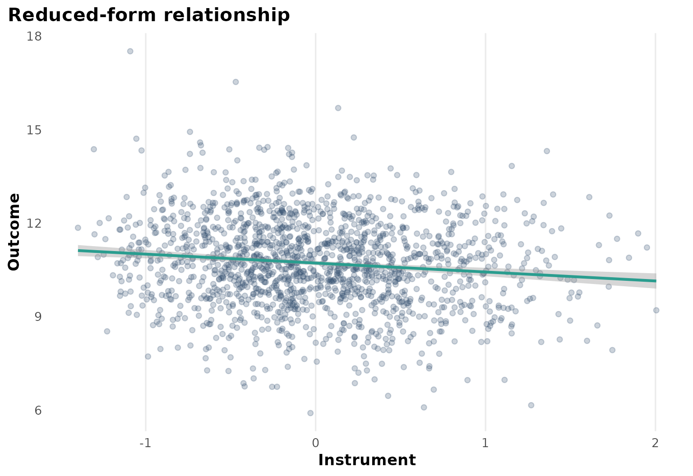

``` r
plot_subgroup_effects(fit_iv)
```

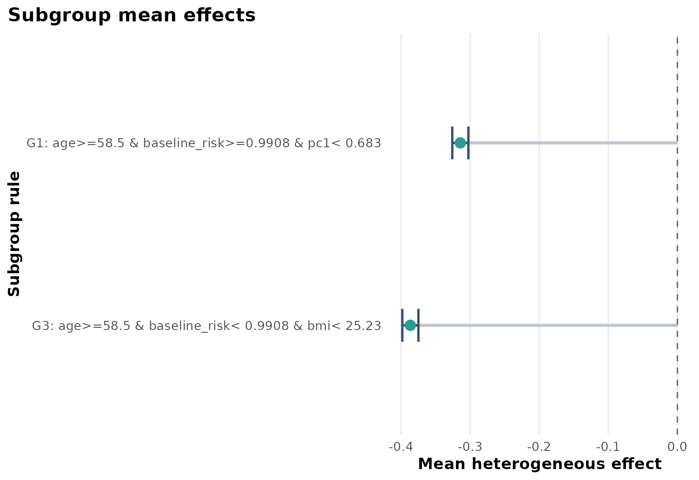

``` r
plot_effect_tree(fit_iv)
```

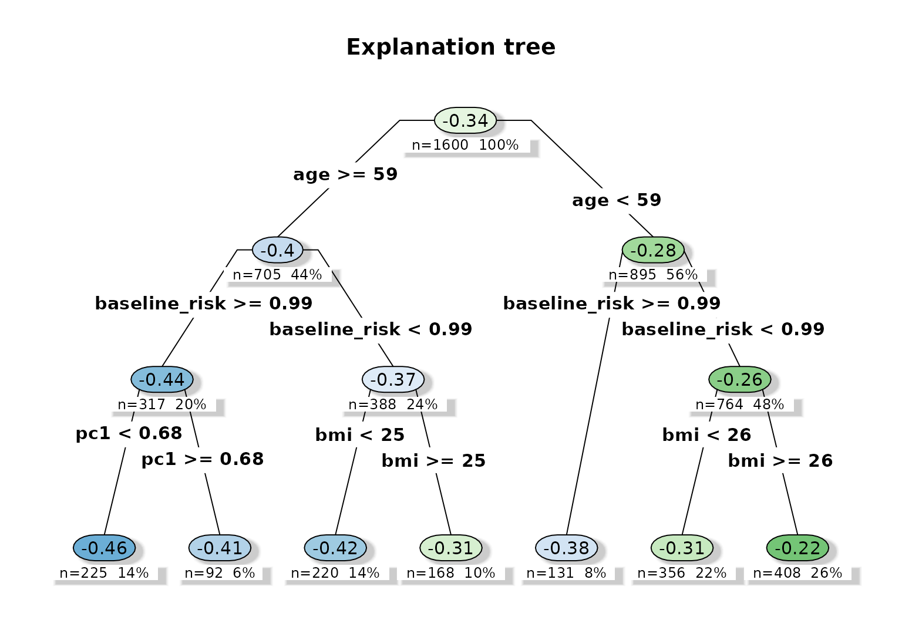

## Common output tables

Every `heteff_fit` object returns the same top-level outputs:

- `effect_table`
- `subgroup_table`
- `tree_table`
- `ranking_table`
- `check_table`
- `estimand_table`
- `variable_importance`

``` r
names(fit_iv)
#>  [1] "analysis_type"       "estimand_label"      "analysis_data"      
#>  [4] "spec"                "config"              "forest"             
#>  [7] "effect_table"        "subgroup_table"      "tree"               
#> [10] "tree_table"          "ranking_table"       "check_table"        
#> [13] "estimand_table"      "variable_importance"
```

## Export tables and plots

``` r
export_tables(fit_iv, "output")
export_plots(fit_iv, "output")
```
