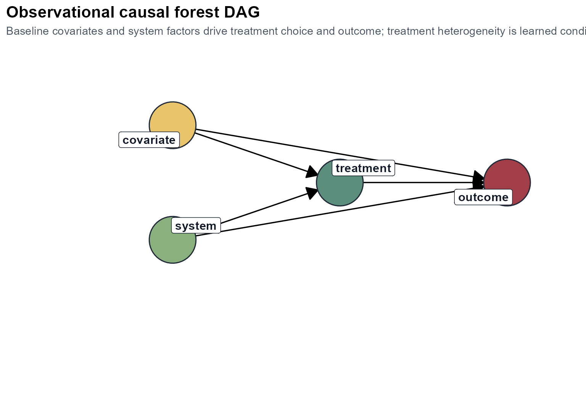
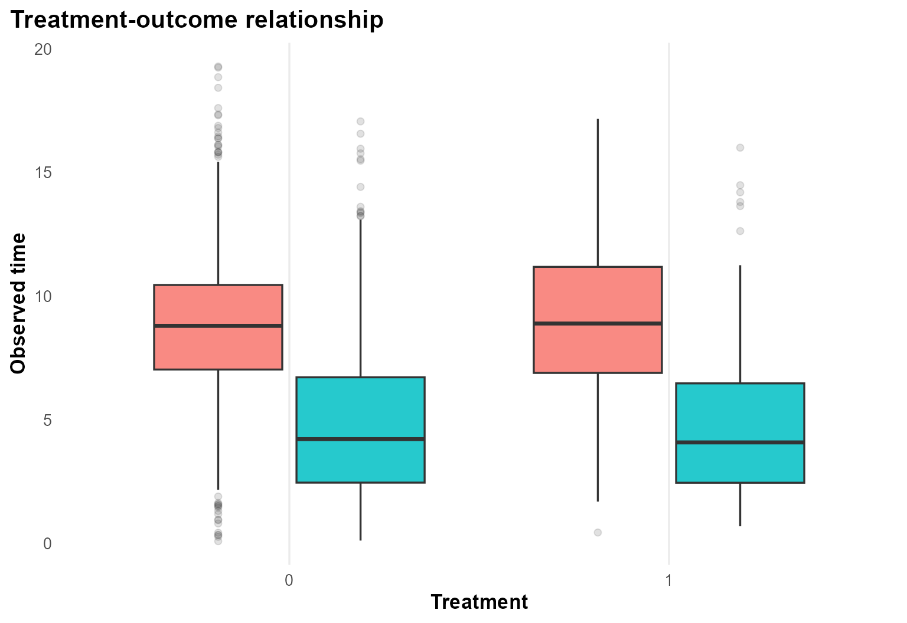
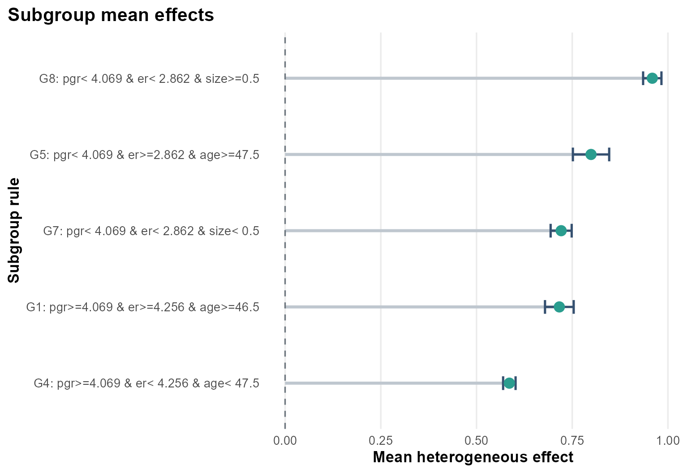
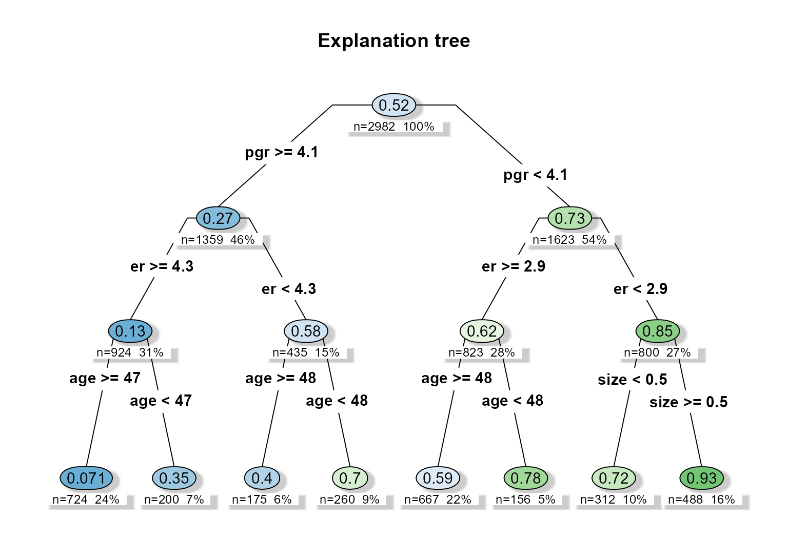
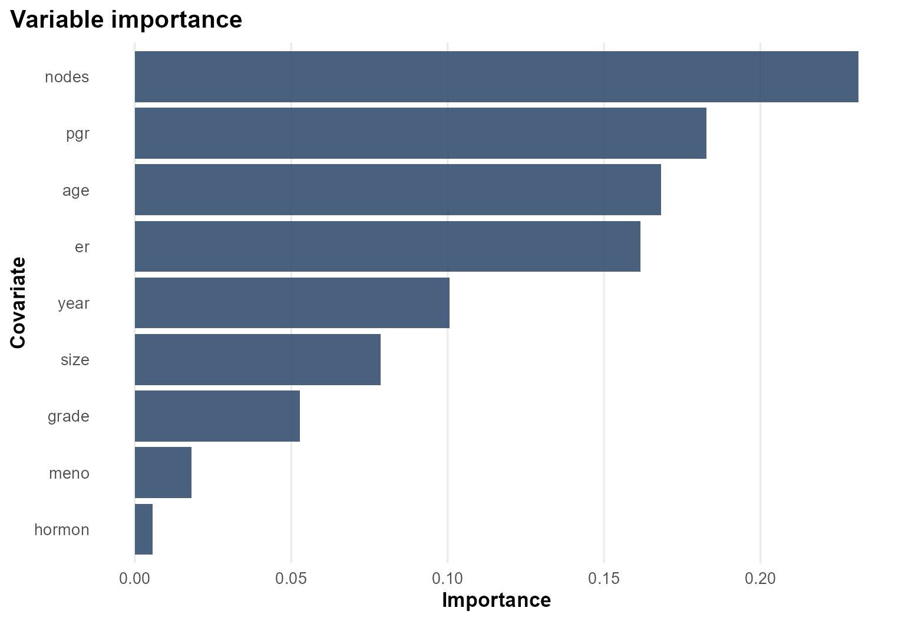

# Case Study: Rotterdam survival

``` r
library(heteff)
```

## Background

[`survival::rotterdam`](https://rdrr.io/pkg/survival/man/rotterdam.html)
is a richer oncology survival dataset than `veteran`, with tumor biology
and treatment variables that allow a more structured heterogeneity
analysis.

## Objective

The goal is to study whether chemotherapy benefit varies with baseline
disease burden and receptor-related biomarkers.

At horizon $`h = 8`$ years, the forest targets subgroup-specific
survival effects summarized as RMST differences or survival-probability
differences, depending on the chosen target.

## Analysis setup

``` r
dat <- prepare_case_rotterdam()

fit <- fit_survival_forest(
  data = dat,
  time = "time",
  event = "event",
  treatment = "treatment",
  covariates = setdiff(names(dat), c("sample_id", "time", "event", "treatment")),
  sample_id = "sample_id",
  horizon = 8,
  seed = 123,
  num_trees = 400,
  tree_minbucket = 120
)
#> Warning in grf::causal_survival_forest(X = as.matrix(analysis_data[,
#> covariates, : Estimated censoring probabilities go as low as: 0.01298 - an
#> identifying assumption is that there exists a fixed positive constant M such
#> that the probability of observing an event past the maximum follow-up time is
#> at least M (i.e. P(T > horizon | X) > M). This warning appears when M is less
#> than 0.05, at which point causal survival forest can not be expected to deliver
#> reliable estimates.
#> Warning in get_scores.causal_survival_forest(forest, subset = subset,
#> debiasing.weights = debiasing.weights, : Estimated treatment propensities take
#> values very close to 0 or 1. The estimated propensities are between 0 and
#> 0.984, meaning some estimates may not be well identified.

fit$check_table
#>             check_name        value status
#> 1            rows_used 2982.0000000   info
#> 2 rows_dropped_missing    0.0000000     ok
#> 3           outcome_sd    3.5539427     ok
#> 4         treatment_sd    0.3958819     ok
#> 5       treatment_rate    0.1945003   info
#> 6      covariate_count   14.0000000   info
#> 7           event_rate    0.4265594     ok
#> 8          censor_rate    0.5734406   info
#> 9              horizon    8.0000000   info
fit$subgroup_table
#>   subgroup                               rule   n effect_mean effect_low
#> 1       G1 pgr>=4.069 & er>=4.256 & age>=46.5 260   0.7163655  0.6789034
#> 2       G4 pgr>=4.069 & er< 4.256 & age< 47.5 667   0.5857752  0.5695050
#> 3       G5 pgr< 4.069 & er>=2.862 & age>=47.5 156   0.7991407  0.7517246
#> 4       G7 pgr< 4.069 & er< 2.862 & size< 0.5 312   0.7210948  0.6936052
#> 5       G8 pgr< 4.069 & er< 2.862 & size>=0.5 488   0.9591277  0.9351884
#>   effect_high
#> 1   0.7538275
#> 2   0.6020454
#> 3   0.8465568
#> 4   0.7485845
#> 5   0.9830670
```

## Design view

``` r
plot_observational_dag()
```



The interpretation is observational: baseline clinical and tumor
features are used to adjust treatment comparisons and to discover effect
modifiers.

## Treatment and observed time

``` r
plot_treatment_outcome(fit)
```



The treatment-outcome panel gives a first sense of follow-up scale and
censoring.

## Heterogeneous effect summary

``` r
plot_subgroup_effects(fit)
```



Compared with the simpler survival example, the Rotterdam case produces
a more layered subgroup structure. The estimated effects vary across
receptor-related and prognostic strata.

## Explanation tree

``` r
plot_effect_tree(fit)
```



The explanation tree is useful here because it turns a high-dimensional
survival forest into a compact rule system involving `pgr`, `er`, `age`,
and `size`.

## Variable importance

``` r
plot_variable_importance(fit)
```



The importance ranking confirms that biologically meaningful covariates
drive most of the heterogeneity in this example.

## Interpretation

This case study is a stronger showcase for the survival workflow
because:

- the covariate space is richer,
- the resulting subgroups are more structured,
- the variable-importance and tree outputs align with recognizable
  clinical axes.

## Limitations

The diagnostics for this dataset can still raise overlap or censoring
warnings. Those warnings should be interpreted seriously. They do not
invalidate the workflow, but they do limit how strongly the subgroup
effects should be treated as decision-ready estimates.
