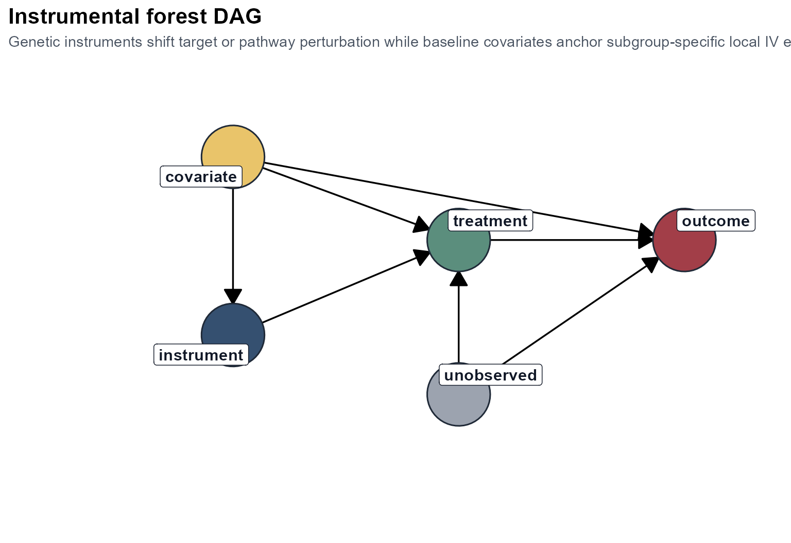

# Theory and Design

``` r
library(heteff)
```

## Overview

`heteff` is built around three generalized random forest estimators:

- [`grf::causal_forest()`](https://rdrr.io/pkg/grf/man/causal_forest.html)
- [`grf::causal_survival_forest()`](https://rdrr.io/pkg/grf/man/causal_survival_forest.html)
- [`grf::instrumental_forest()`](https://rdrr.io/pkg/grf/man/instrumental_forest.html)

The package is intentionally small. It assumes that the user has already
defined an analysis table and wants a consistent way to:

1.  estimate heterogeneous effects,
2.  summarize the fitted forest into reusable tables,
3.  expose the dominant effect modifiers through a shallow explanation
    tree.

The goal is not to replace `grf`, but to make a narrow subset of `grf`
workflows easier to run repeatedly and easier to communicate.

## Observed data and notation

For each sample $`i = 1, \dots, n`$, let:

- $`X_i \in \mathbb{R}^p`$ be a vector of baseline covariates,
- $`W_i`$ be treatment or exposure,
- $`Y_i`$ be the outcome,
- $`Z_i`$ be an instrument when an IV design is used.

The package works with two observed-data structures.

### Observational and survival workflows

``` math

O_i = (Y_i, W_i, X_i)
```

The user is asserting that, conditional on $`X_i`$, treatment assignment
is ignorable enough for a causal-forest analysis to be meaningful.

### Instrumental workflow

``` math

O_i = (Y_i, W_i, Z_i, X_i)
```

The user is asserting that $`Z_i`$ is a valid instrument after
conditioning on the chosen baseline covariates $`X_i`$.

## Core estimands

## Observational causal forest

The observational workflow targets the conditional average treatment
effect:

``` math

\tau(x) = E[Y(1) - Y(0) \mid X = x].
```

This estimand asks how much expected outcome changes when treatment
changes from 0 to 1, among samples with baseline profile $`X = x`$.

In practice,
[`grf::causal_forest()`](https://rdrr.io/pkg/grf/man/causal_forest.html)
uses orthogonalization and forest-based adaptive neighborhood weighting
to estimate $`\tau(x)`$ without forcing the user to specify one global
parametric interaction model.

## Survival causal forest

For right-censored outcomes, `heteff` uses
[`grf::causal_survival_forest()`](https://rdrr.io/pkg/grf/man/causal_survival_forest.html).
At a user-specified horizon $`h`$, the estimand is one of:

``` math

\tau_{\text{RMST}}(x; h) =
E[\min(T(1), h) - \min(T(0), h) \mid X = x]
```

or

``` math

\tau_{S}(x; h) =
P(T(1) > h \mid X = x) - P(T(0) > h \mid X = x).
```

The first is a subgroup-specific restricted mean survival time
difference up to horizon $`h`$. The second is a subgroup-specific
survival-probability difference at the same horizon.

These are useful because they turn a time-to-event problem into an
estimand that can be compared across clinically interpretable subgroups.

## Instrumental forest

The IV workflow uses
[`grf::instrumental_forest()`](https://rdrr.io/pkg/grf/man/instrumental_forest.html)
and targets:

``` math

\tau(x) = \frac{\mathrm{Cov}(Y, Z \mid X = x)}
{\mathrm{Cov}(W, Z \mid X = x)}.
```

This is the local IV effect identified by instrument-induced variation
in $`W`$, conditional on $`X = x`$. When the IV assumptions hold, this
quantity can be interpreted as a subgroup-specific local causal effect.

The ratio form is important:

- the numerator measures how the instrument shifts the outcome,
- the denominator measures how the instrument shifts the exposure,
- their ratio scales the reduced-form association into a local causal
  effect.

## Design assumptions

`heteff` does not prove design validity. It assumes the design has
already been chosen well enough that a heterogeneous-effect analysis is
sensible.

## Observational assumptions

For the observational and survival workflows, the main assumptions are:

1.  consistency,
2.  no interference,
3.  conditional exchangeability given $`X`$,
4.  overlap or positivity.

In practical terms, this means the covariate set should be
baseline-only, clinically defensible, and rich enough to capture major
confounding pathways.

## Instrumental assumptions

For the IV workflow, the main assumptions are:

1.  relevance: $`Z`$ shifts $`W`$,
2.  exclusion: $`Z`$ affects $`Y`$ only through $`W`$,
3.  instrument independence given $`X`$,
4.  enough overlap and effective first-stage strength.

The package cannot guarantee these assumptions, but it does report a
compact `check_table` that includes first-stage correlation and an
F-statistic as a minimal diagnostic layer.

## DAGs

The package ships with two compact design DAGs.

### Observational DAG

``` r
plot_observational_dag()
```


Interpretation:

- baseline covariates and system factors affect both treatment and
  outcome,
- the causal target is identified by adjusting for baseline $`X`$,
- subgroup heterogeneity is modeled as effect variation over $`X`$.

### Instrumental DAG

``` r
plot_instrumental_dag()
```



Interpretation:

- unmeasured factors may jointly affect $`W`$ and $`Y`$,
- the instrument supplies exogenous variation in $`W`$,
- baseline covariates anchor subgroup-specific local IV effects.

## What the package computes

The package-level workflow is the same across estimators.

1.  Build the forest from one analysis table.
2.  Predict sample-level heterogeneous effects.
3.  Aggregate predicted effects into subgroup summaries.
4.  Fit a shallow explanation tree to the predicted effects.
5.  Rank candidates within subgroup when a `candidate` column is
    present.

This produces a shared output contract:

- `effect_table`
- `subgroup_table`
- `tree_table`
- `ranking_table`
- `check_table`
- `estimand_table`
- `variable_importance`

## Explanation tree as a reporting layer

The explanation tree is not the forest itself. This distinction matters.

The forest is the primary estimator. It is flexible, local, and
ensemble-based. The explanation tree is a secondary model fit to the
predicted effects:

``` math

\widehat{\tau}_i = \widehat{\tau}(X_i)
```

followed by a shallow regression tree:

``` math

\widehat{\tau}_i \approx g(X_i).
```

This second-stage tree is used only to create readable subgroup rules.
It is a communication layer, not a replacement estimand.

## Why the package stays simple

The package does not attempt to expose all of `grf`. It stays centered
on three estimators because those three correspond to three common
design classes:

- treatment-effect heterogeneity in observational data,
- heterogeneous effects for right-censored survival outcomes,
- local IV heterogeneity in instrumental settings.

That constraint keeps the interface readable, the outputs stable, and
the tutorials coherent.
